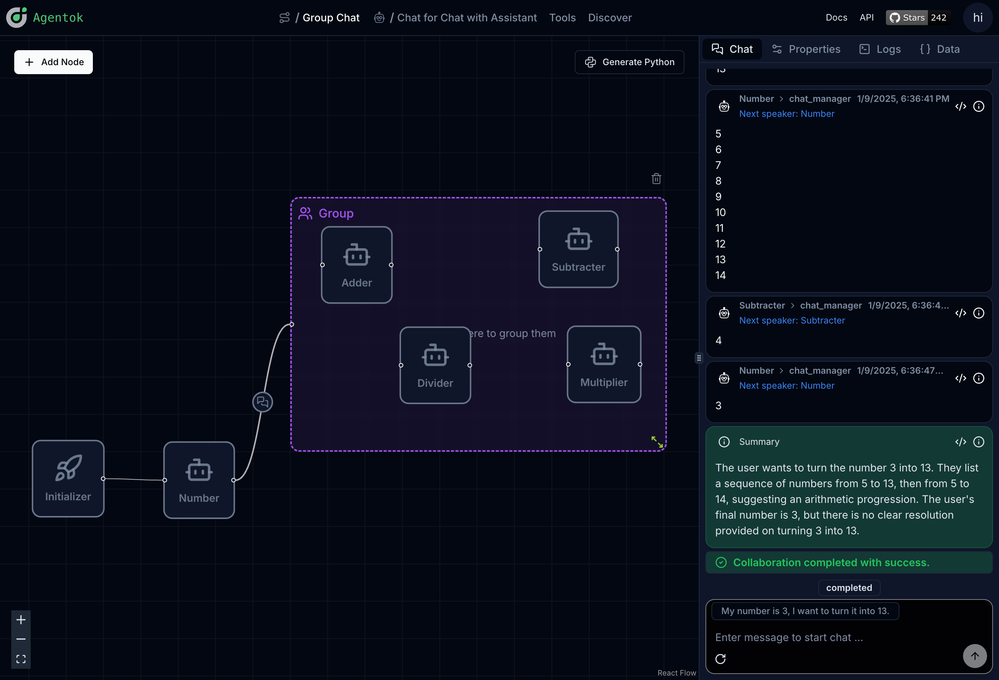
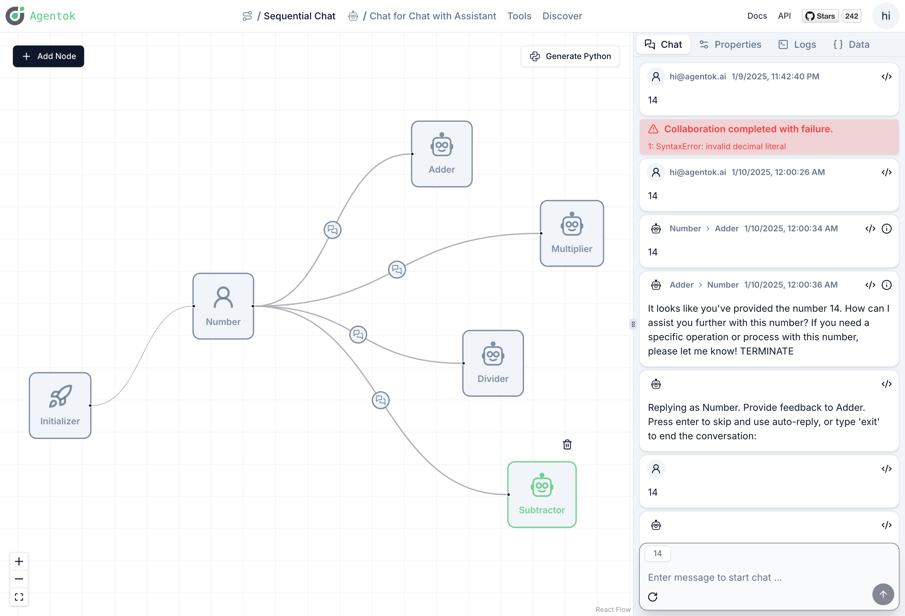
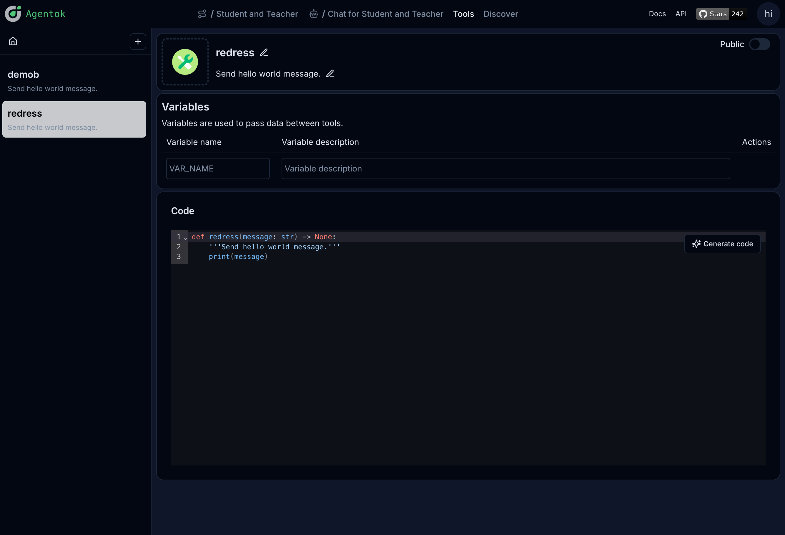
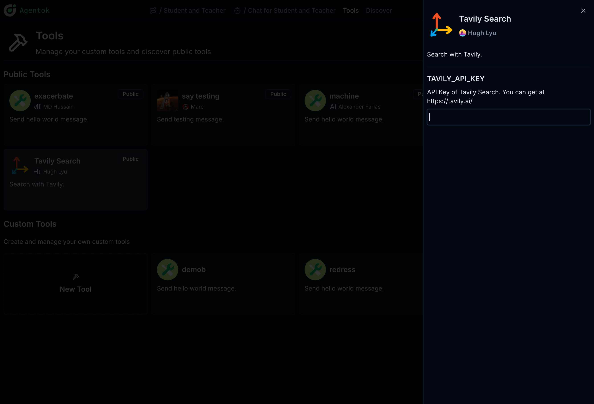
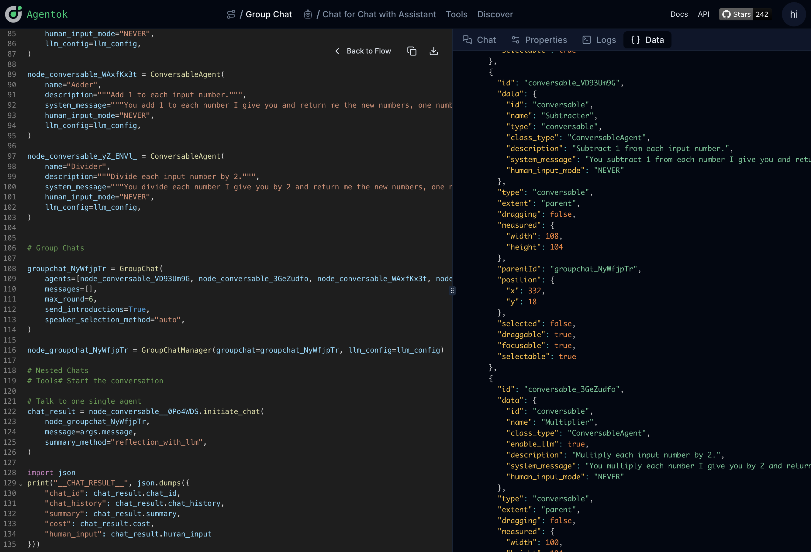
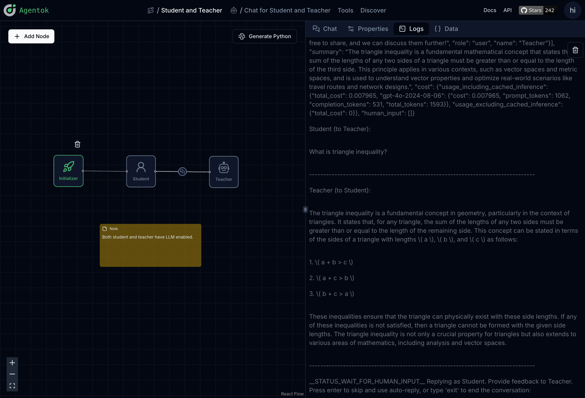

# Agentok Studio

**AG2 Visualized - Build Agentic Apps with Drag-and-Drop Simplicity.**

[](https://vscode.dev/redirect?url=vscode://ms-vscode-remote.remote-containers/cloneInVolume?url=https://github.com/dustland/agentok)
[](https://codespaces.new/dustland/agentok)
[](https://opensource.org/licenses/Apache-2.0)

[](https://star-history.com/#dustland/agentok)
[](https://github.com/ag2ai/ag2)

> [!IMPORTANT]
> **Agentok Studio now targets [AG2 v1](https://github.com/ag2ai/ag2) (`ag2==1.0.0b0`).**
> Codegen emits the protocol-driven API (`import ag2`, `Agent`, and `ag2.network` hubs/channels)—not the classic `autogen` / `ConversableAgent` stack.
> Some legacy node types (Captain, Nested Chat, Retrieve, GPT Assistant, etc.) are not supported yet and will fail codegen with a clear error.

🎉 February 10, 2025: Introduced a DeepSeek Assistant Node. Meanwhile, we also added a new feature that allows users to configure the LLM model for all conversable nodes.

> [!Note]
> We're currently busy working on the backend framework project [VibeX](https://github.com/dustland/vibex), as the new backend of Agentok. Please let us know any of your thoughts by [Open an Issue](https://github.com/dustland/vibex/issues/new).

## 🌟 What is Agentok Studio

Agentok Studio is a tool built upon [AG2](https://github.com/ag2ai/ag2) (Previously AutoGen), a powerful agent framework from Microsoft and [a vibrant community of contributors](https://github.com/ag2ai/ag2?tab=readme-ov-file#contributors-wall).

### Visualizing AG2

We consider AG2 to be at the forefront of next-generation Multi-Agent Applications technology. Agentok Studio takes this concept to the next level by offering intuitive visual tools that streamline the creation and management of complex agent-based workflows.



### Conversation Relations

The relationship between two agents is essential. To incorporate tool calls in a conversation, the LLM must determine which tools to invoke, while informing the user proxy about which nodes to execute. Configuring tools on the edge between these nodes is crucial for optimal operation.



You can switch between light and dark themes using the toggle in the top right corner.

For more information related to Conversation Patterns, please refer to [Conversation Patterns](https://docs.ag2.ai/docs/tutorial/conversation-patterns).

### Tools

We provide a tool editor to help you create and manage tools.



The tool can contain variables, which users can configure in the tool management page.



### Full Visibility of Code and Data

We strive to create a user-friendly tool that generates native Python code with minimal dependencies. Simply put, Agentok Studio is a diagram-based code generator for AG2. The generated code is self-contained and can be executed anywhere as a normal Python program, targeting the official `ag2` 1.0 API (`Agent` + `ag2.network`).



As shown above, we provide full visibility into the underlying data representation of the flow for diagnosis and debugging.

We also attached the original logs(stdout and stderr) from AG2 execution, so you can fully understand the underlying execution process:



> [!Note]
> RAG feature has been removed from this project, as we believe it should be a separate service.

## 💡 Quickstart

Visit [https://studio.agentok.ai](https://studio.agentok.ai) to quickly explore Agentok Studio's features. While we offer an online deployment, please note that it is not intended for production use. The service level agreement is not guaranteed, and stored data may be wiped due to breaking changes.

After signing in with GitHub, Google, or email, click **Create New Project** to start a new project. Each new project comes with a sample workflow. Switch to the **Chat** tab to begin the conversation.


For a more in-depth look at the project, see [Getting Started](https://agentok.ai/docs/getting-started) and [Studio Features](https://agentok.ai/docs/guides/build).

## 🐳 Run the API with Docker (optional)

The API can be run in Docker. The frontend is a standard Next.js app — run it with `pnpm dev` locally or deploy to a platform like Railway without a Dockerfile.

Before starting, prepare the API environment:

```bash
cp api/.env.sample api/.env
cp api/OAI_CONFIG_LIST.sample api/OAI_CONFIG_LIST
```

Start the API with docker-compose:

```bash
docker-compose up -d
```

Or build and run the API image directly:

```bash
docker build -t agentok-api ./api
docker run -d -p 5004:5004 --env-file api/.env agentok-api
```

## 🛠️ Run Locally

### Frontend

1. Navigate to the frontend directory: `cd frontend`
2. Copy `.env.sample` to `.env.local` and configure variables
3. Install dependencies: `pnpm install`
4. Start the development server: `pnpm dev`

> Note: If you encounter frequent Server Errors related to `useContext`, try removing `--turbo` from the **dev** command in package.json.

For production, set `NEXT_PUBLIC_SUPABASE_URL`, `NEXT_PUBLIC_SUPABASE_ANON_KEY`, and `NEXT_PUBLIC_BACKEND_URL` in your hosting provider's environment variables before building. These values are baked into the Next.js bundle at build time.

### Backend

1. Navigate to the api directory: `cd api`
2. Rename `.env.sample` to `.env` and `OAI_CONFIG_LIST.sample` to `OAI_CONFIG_LIST`
3. Install Poetry
4. Start the service: `poetry run uvicorn agentok_api.main:app --reload --port 5004`

`REPLICATE_API_TOKEN` is required for LLaVA agent functionality.

**IMPORTANT**: Generated scripts use AG2 1.0 (`ag2==1.0.0b0`). Code execution defaults to a local sandbox (`LocalEnvironment`); for stronger isolation, configure a Docker-backed environment in your own extensions. Provide model credentials via Studio settings or `api/OAI_CONFIG_LIST`.

This project uses Supabase for authentication and data storage. Follow [./db/README.md](./db/README.md) to prepare the database and set environment variables (`SUPABASE_*` in `.env.sample`).

Use the **anon** key for `NEXT_PUBLIC_SUPABASE_ANON_KEY` (frontend) and the **service role** key for `SUPABASE_SERVICE_KEY` (API).

Once services are running, access:

- API: http://localhost:5004 (OpenAPI docs: http://localhost:5004/docs)
- Frontend: http://localhost:2855

### Observability with AgentOps

We use [AgentOps](https://agentops.ai) to monitor the performance of the system. To enable it, you can set environment variable `AGENTOPS_API_KEY` in `api/.env`.

## 👨‍💻 Contributing

We welcome all contributions! This includes code, documentation, and other project aspects. Open a [GitHub Issue](https://github.com/hughlv/agentok/issues/new) or join our [Discord Server](https://discord.gg/xBQxwRSWfm).

Please read our [Contributing Guide](./CONTRIBUTING.md) before getting started.

New to GitHub? Check out their [guide on collaborating with issues and pull requests](https://help.github.com/categories/collaborating-with-issues-and-pull-requests/).

Consider contributing to [AG2](https://github.com/ag2ai/ag2) as well, since Agentok Studio builds upon its capabilities.

This project uses [📦🚀semantic-release](https://github.com/semantic-release/semantic-release) for versioning and releases. Releases are triggered manually via GitHub Actions to avoid excessive automation.

We enforce [Commitlint](https://commitlint.js.org/#/) conventions for commit messages.

## Contributors Wall

<a href="https://github.com/hughlv/agentok/graphs/contributors">
  
</a>

## 📝 License

This project is licensed under the [Apache 2.0 License with additional terms and conditions](./LICENSE.md).

## 📖 Citation

If you find this project useful, please consider citing it:

```bibtex
@misc{agentok,
  author = {Dustland},
  title = {Agentok Studio},
  year = {2025},
  publisher = {GitHub},
  journal = {GitHub repository},
  howpublished = {\url{https://github.com/dustland/agentok}}
}
```
