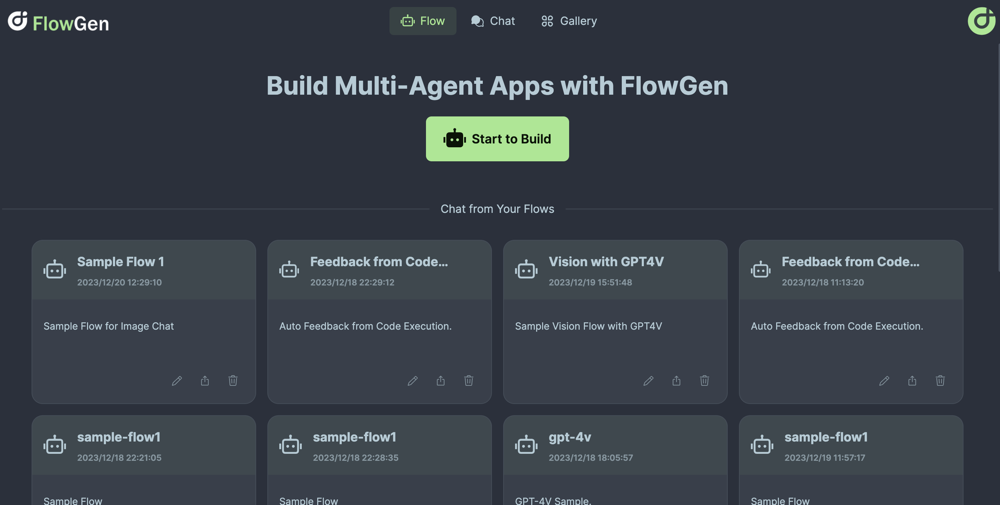
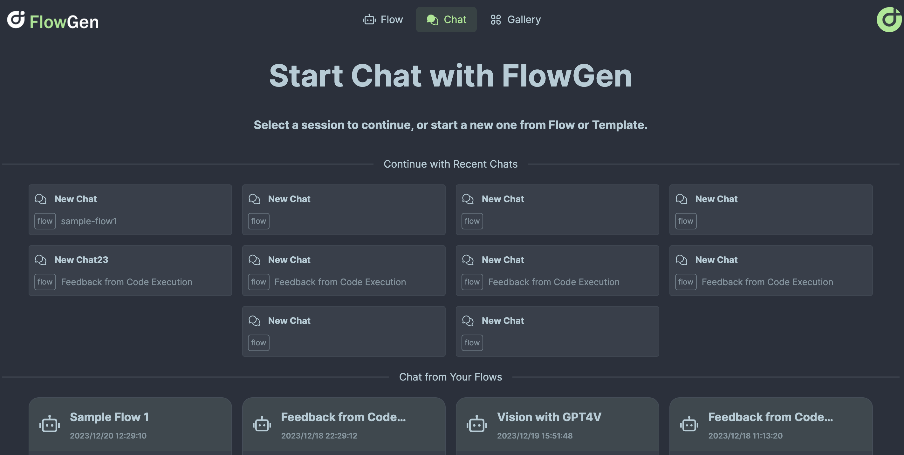
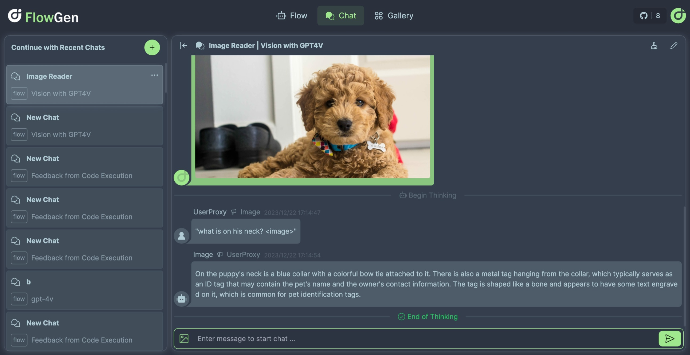
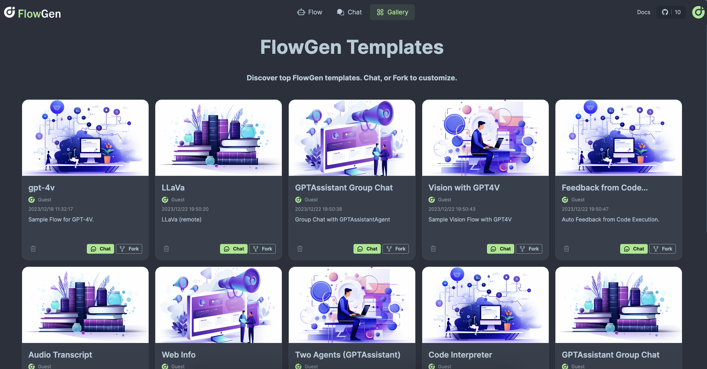

> [!IMPORTANT]
>
> <font color="red"><b>This project is still under heavy development and functions might not work well yet. Please don't hestitate to <a href="https://github.com/tiwater/flowgen/issues/new">open new issues</a>.</b></font>


# FlowGen - AutoGen Visualized

[](https://opensource.org/licenses/Apache-2.0)
[](https://star-history.com/#tiwater/flowgen)


## 🤖 What is FlowGen

FlowGen is a tool built for [AutoGen](https://microsoft.github.io/autogen/), a great agent framework from Microsoft Research.

AutoGen streamlines the process of creating multi-agent applications with its clear and user-friendly approach. FlowGen takes this accessibility a step further by offering visual tools that simplify the building and management of agent workflows with AutoGen.

### Visual Flow Editing




### Chat





### Gallery



## 💡 Quickstart

To quickly explore what FlowGen has to offer, simply visit it [https://flowgen.app](https://flowgen.app).

Each new commit to the main branch triggers an automatic deployment on [Railway.app](https://railway.app), ensuring you experience the latest version of the service.

> [!WARNING]
>
> Changes to Pocketbase project will cause the rebuild and redeployment of all instances, which will swipe all the data.
>
> Please do not use it for production purpose, and make sure you export flows in time.

## 🐳 Run on Local (with Docker)

The project contains Frontend (Built with Next.js) and Backend service (Built with Flask in Python), and have been fully dockerized.

The easiest way to run on local is using docker-compose:

```bash
docker-compose up -d
```

You can also build and run the frontend and backend services separately with docker:

```bash
docker build -t flowgen-svc ./backend
docker run -d -p 5004:5004 flowgen-svc

docker build -t flowgen-ui ./frontend
docker run -d -p 2855:2855 flowgen-ui

docker build -t flowgen-db ./pocketbase
docker run -d -p 7676:7676 flowgen-db
```

(The default port number 2855 is the address of our first office.)

## 🚀 Deployment

[](https://railway.app/template/NCoZBC?referralCode=5I-BUc)

Railway.app supports the deployment of applications in Dockers. By clicking the "Deploy on Railway" button, you'll streamline the setup and deployment of your application on Railway platform:

1. Click the "Deploy on Railway" button to start the process on Railway.app.
2. Log in to Railway and set the following environment variables:
   - `PORT`: Please set for each services as `2855`, `5004`, `7676` respectively.
3. Confirm the settings and deploy.
4. After deployment, visit the provided URL to access your deployed application.

## 🛠️ Run on Local (Without Docker)

If you're interested in contributing to the development of this project or wish to run it from the source code, you have the option to run the frontend and backend services independently. Here's how you can do that:

1. **Frontend Service:**

   - Navigate to the frontend service directory.
   - Rename `.env.sample` to `.env.local` and set the value of variables correctly.
   - Install the necessary dependencies using the appropriate package manager command (e.g., `pnpm install` or `yarn`).
   - Run the frontend service using the start-up script provided (e.g., `pnpm dev` or `yarn dev`).

2. **Backend Service:**

   - Switch to the backend service directory `cd backend`.
   - Create virtual environment: `python3 -m venv venv`.
   - Activate virtual environment: `source venv/bin/activate`.
   - Install all required dependencies: `pip install -r requirements.txt`.
   - Launch the backend service using command `uvicorn app.main:app --reload --port 5004`.

`REPLICATE_API_TOKEN` is needed for LLaVa agent. If you need to use this agent, make sure to include this token in environment variables, such as the Environment Variables on Railway.app.

3. **PocketBase:**

   - Switch to the PocketBase directory `cd pocketbase`.
   - Build the container: `docker build -t flowgen-db .`
   - Run the container: `docker run -it --rm -p 7676:7676 flowgen-db`

Once you've started both the frontend and backend services by following the steps previously outlined, you can access the application by opening your web browser and navigating to:

- Frontend: http://localhost:2855
- Backend: http://localhost:5004 (Here I should provide a Swagger API doc, maybe later.)
- PocketBase: http://localhost:7676

If your services are started successfully and running on the expected ports, you should see the user interface or receive responses from the backend via this URL.

## Migration of Official Examples

Please check the original notebooks with the same name in [AutoGen](https://github.com/microsoft/autogen/blob/main/notebook/).

🔲 Planned
✅ Completed
⭕ Out of Scope

| Example                                 | Status | Comments                                                  |
| --------------------------------------- | ------ | --------------------------------------------------------- |
| [auto_feedback_from_code_execution]()   | ✅     | [Feedback from Code Execution](https://flowgen.app/flow/) |
| auto_build                              | 🔲     |                                                           |
| chess                                   | 🔲     |                                                           |
| compression                             | 🔲     |                                                           |
| dalle_and_gpt4v                         | 🔲     | This requires the import of custom Agent class            |
| function_call_async                     | ✅     |                                                           |
| function_call                           | ✅     |                                                           |
| graph_modelling_language                | ⭕     | This is out of project scope. Open an issue if necessary  |
| group_chat_RAG                          | ✅     | This notebook does not work                               |
| groupchat_research                      | ✅     |                                                           |
| groupchat_vis                           | ✅     |                                                           |
| groupchat                               | ✅     |                                                           |
| hierarchy_flow_using_select_speaker     | 🔲     |                                                           |
| human_feedback                          | 🔲     |                                                           |
| inception_function                      | 🔲     |                                                           |
| langchain                               | ⭕     | No plan to support                                        |
| lmm_gpt-4v                              | ✅     |                                                           |
| lmm_llava                               | ✅     | Depends on Replicate                                      |
| MathChat                                | 🔲     |                                                           |
| oai_assistant_function_call             | ✅     |                                                           |
| oai_assistant_groupchat                 | ✅     | Very slow and not work well, sometimes not returning.     |
| oai_assistant_retrieval                 | 🔲     |                                                           |
| oai_assistant_twoagents_basic           | 🔲     |                                                           |
| oai_code_interpreter                    | 🔲     |                                                           |
| planning                                | 🔲     |                                                           |
| qdrant_RetrieveChat                     | 🔲     |                                                           |
| RetrieveChat                            | 🔲     |                                                           |
| stream                                  | 🔲     |                                                           |
| teachability                            | 🔲     |                                                           |
| teaching                                | 🔲     |                                                           |
| two_users                               | 🔲     |                                                           |
| video_transcript_translate_with_whisper | 🔲     |                                                           |
| web_info                                | 🔲     |                                                           |
| cq_math                                 | 🔲     |                                                           |
| Async_human_input                       | 🔲     |                                                           |
| oai_chatgpt_gpt4                        | 🔲     |                                                           |
| oai_client_cost                         | 🔲     |                                                           |
| oai_completion                          | 🔲     |                                                           |
| oai_openai_utils                        | 🔲     |                                                           |

## 👨‍💻 Contributing

This project welcomes contributions and suggestions. Please read our [Contributing Guide](./CONTRIBUTING.md) first.

If you are new to GitHub [here](https://help.github.com/categories/collaborating-with-issues-and-pull-requests/) is a detailed help source on getting involved with development on GitHub.

## Contributors Wall

<a href="https://github.com/tiwater/flowgen/graphs/contributors">
  
</a>

## 📝 License

The project is licensed under [Apache 2.0 with additional terms and conditions](./LICENSE.md).
