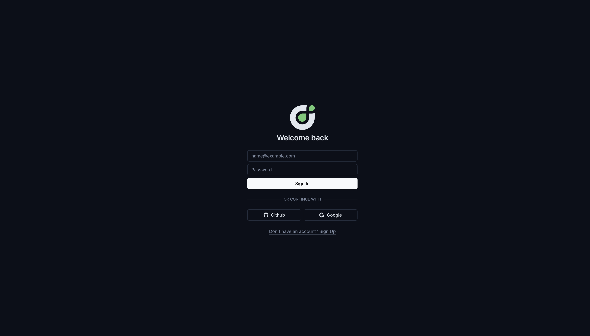
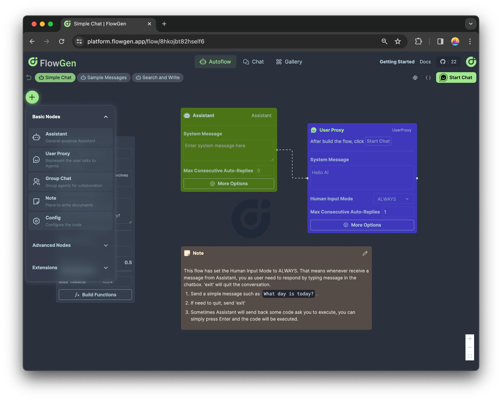
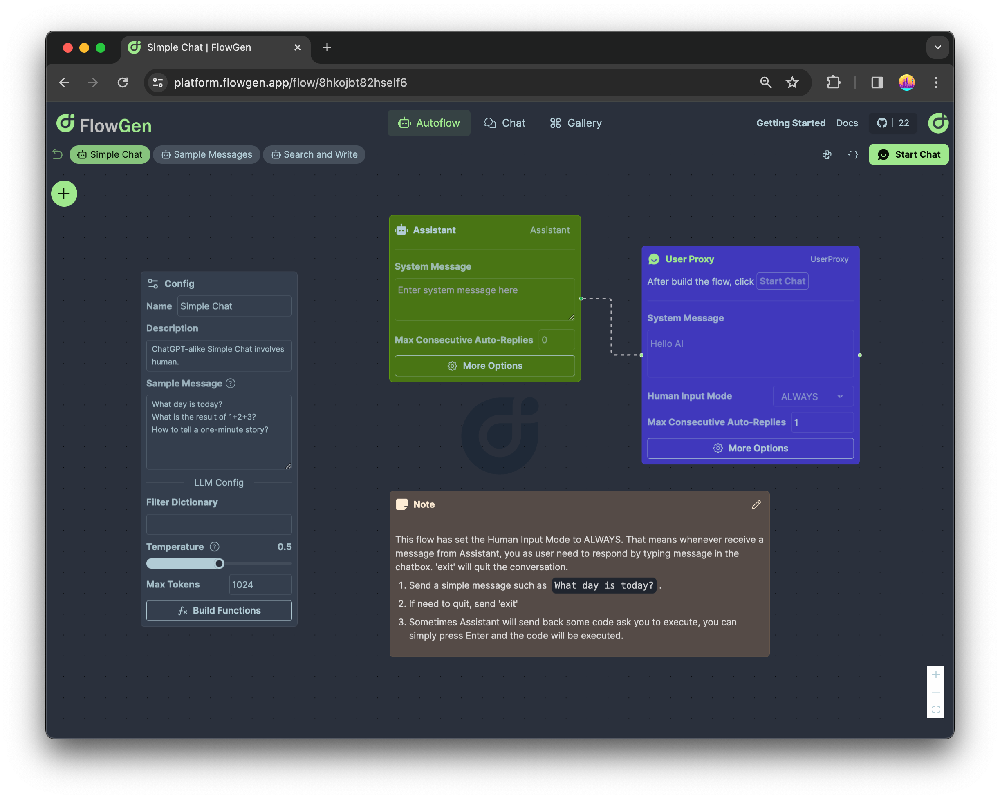
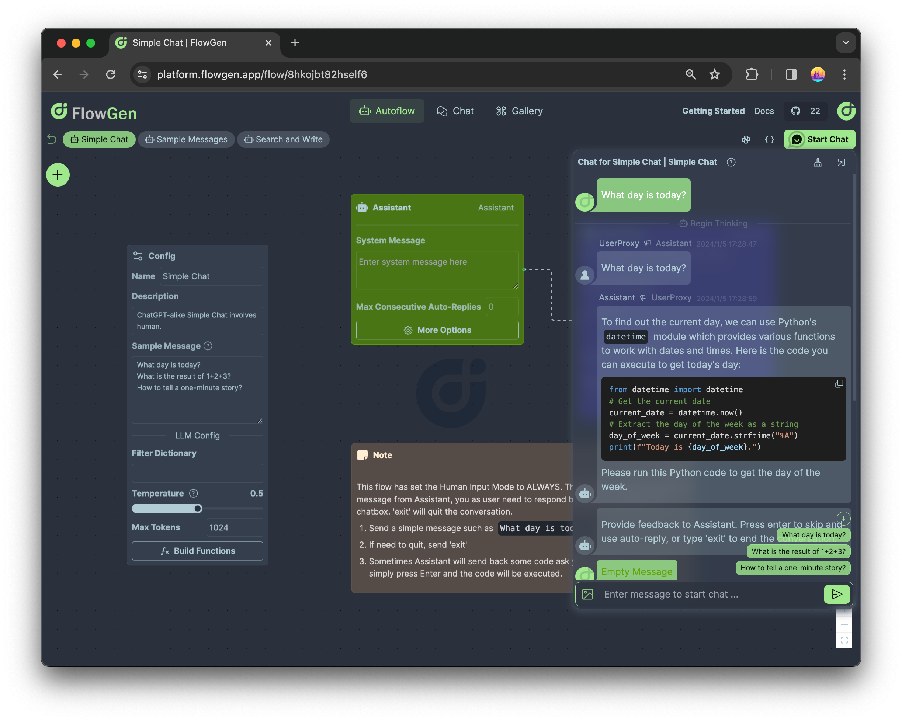
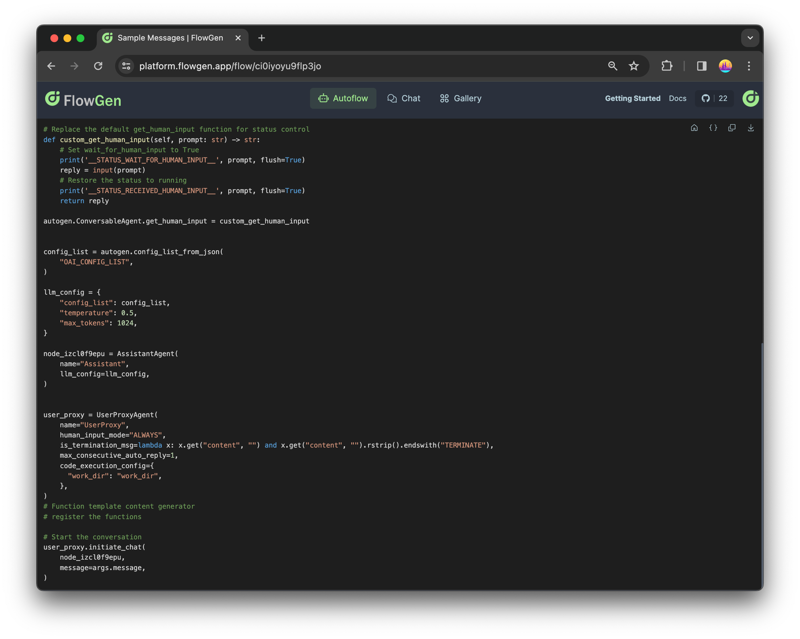
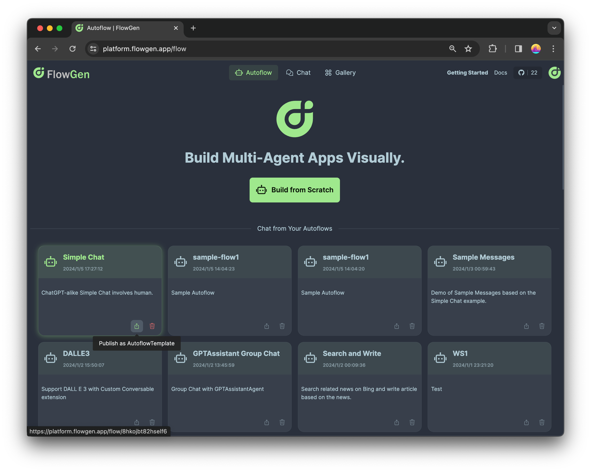
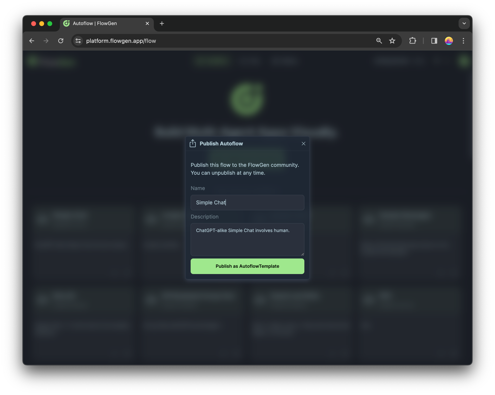
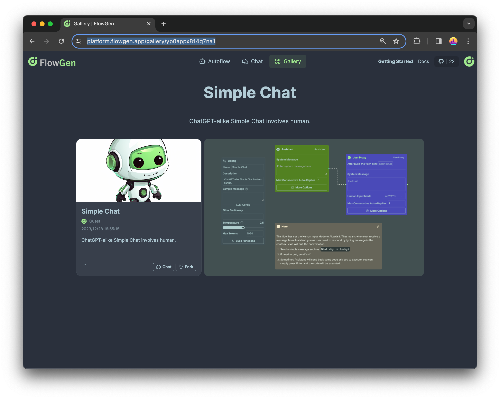

# Getting Started

## What is Agentok Studio

Agentok Studio is a visual builder for [AG2](https://github.com/ag2ai/ag2) (formerly AutoGen), a multi-agent framework from Microsoft Research and the AG2 community.

AG2 streamlines the creation of multi-agent applications. Agentok Studio adds a drag-and-drop canvas for designing agent workflows, running chats, and exporting self-contained Python code.

## Key Concepts

### Agent

The **Agent** is the core concept in AG2 and Agentok Studio. For most applications this means a **ConversableAgent**, which includes two common types: **AssistantAgent** and **UserProxyAgent**.

- **Assistant Agent** — LLM-powered helper (chatbot, coder, planner, or a mix)
- **UserProxy Agent** — human interface, code executor, or both

### Workflow

A **Workflow** is a network of agents on the canvas. Most workflows have one UserProxy and one or more Assistants.

### Chat

A **Chat** is a live session started from a workflow.

### Template

A published workflow others can fork or run via a shareable link.

## "Hello World"

### Sign in and create a project

Go to [studio.agentok.ai](https://studio.agentok.ai/auth/login) and sign in with **GitHub**, **Google**, or email.

Open **Projects** and click **Build from Scratch** to create a new workflow.

### Build your first workflow

Clear any sample nodes, then:

1. Click **+** and add an **Assistant** agent.
2. Add a **User** agent.
3. Connect them with an edge.

Recommended settings:

- **Human Input Mode** → `ALWAYS` so you can intervene at any time
- **Max Consecutive Auto Replies** → `1` for a simple assistant ↔ user proxy loop
- Add **Sample Messages** on the Initializer node so users have prompts to click

### Start a chat

Click **Start Chat** in the toolbar. Pick a sample message and send it:

> [!TIP]
> Multi-agent runs can take seconds or minutes. Check [Code & Debugging](/docs/guides/build/code-and-logs) if you need to see what is happening under the hood.

### Inspect the generated code

Click the Python icon in the toolbar:

The script depends on AG2 only. Copy or download it and run locally.

### Publish as a template

From **Projects**, open a workflow card and click **Publish as Template**:

Published templates appear on **Discover**:

Share the URL so others can chat or fork your workflow.

## Next steps

- [Studio Features](/docs/guides/build) — canvas, patterns, tools, codegen, templates
- [Concepts](/docs/concepts) — AG2 terminology
- [Ask Planner example](/docs/examples/ask-planner) — subflows with custom functions
- [API](/docs/guides/using/api) — integrate chats programmatically

## Further reading

- [AG2 documentation](https://docs.ag2.ai/)
- [Agentok Studio GitHub](https://github.com/dustland/agentok)
