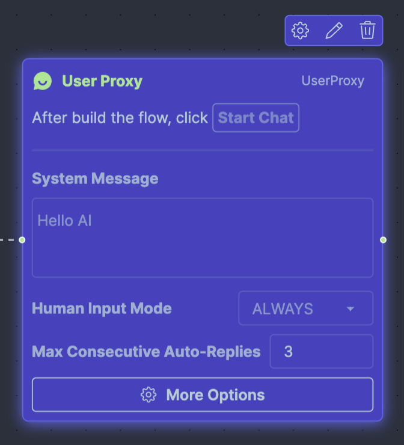
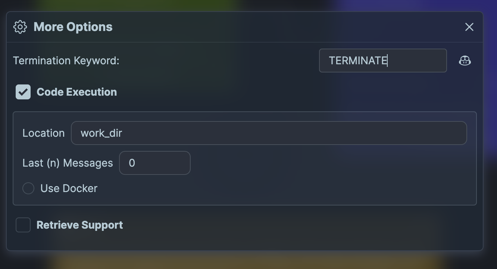
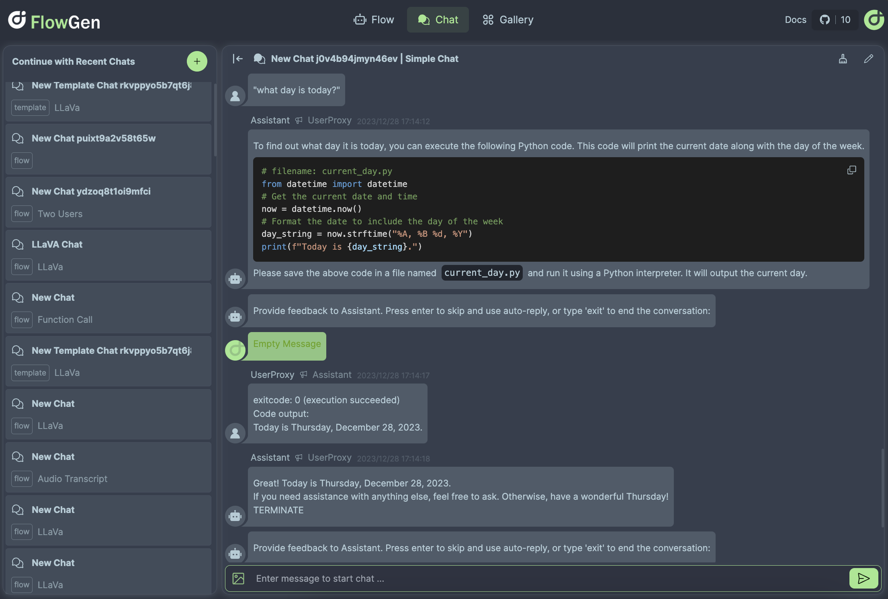
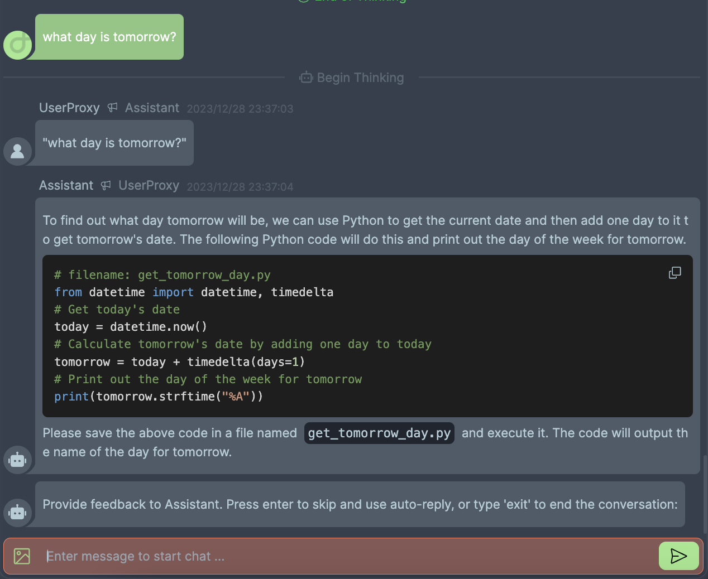

# Human in the Loop

This tutorial provides step-by-step guidance on constructing a workflow that incorporates a human-in-the-loop approach. Utilizing the FlowGen template, [Human in the Loop](https://platform.flowgen.app/templates/4pbokrvi7zguv48), you can engage with it directly or fork it to tweak the flow to your specifications.

The tutorial leverages the official notebooks [Simple Chat](https://github.com/microsoft/autogen/blob/main/samples/simple_chat.py) and [Human Feedback](https://github.com/microsoft/autogen/blob/main/notebook/agentchat_human_feedback.ipynb) as its foundation.

## Prerequisites

You’ll need access to FlowGen, which is accessible either [online](https://platform.flowgen.app) for immediate use or [locally on your machine](https://docs.flowgen.app/getting-started) for a more personalized setup. This guide will focus on utilizing the online version of FlowGen.

## Steps to Create a New Workflow

### Initialize a New Autoflow

Begin by signing into FlowGen. Once logged in, opt for the 'Build from Scratch' option to establish a new Autoflow.

### Orchestrating Your Workflow

First, clear the canvas by removing any pre-loaded sample nodes. Next, populate your workflow by adding the following nodes:

- **Assistant Agent**: This will serve as the workflow's Assistant.
- **UserProxy Agent**: Label this as `UserProxy`.

Refer to the accompanying illustration to visualize the flow arrangement:

### Configuring Your Agents

The primary focus here is on configuring the UserProxy Agent:

1. Alter the `Human Input Mode` setting to `ALWAYS`.

2. Adjust the `Max Consecutive Auto Replies` to a value greater than `0`, such as `3`. This allows the UserProxy Agent to independently execute received code and dispatch the results back to the Assistant Agent.

3. Click the **More Options** button on the UserProxy Agent. In the revealed dialog, activate `Code Execution Config` by marking the corresponding checkbox.

4. Still within the dialog, define the termination message command as `TERMINATE` by clicking the robot icon adjacent to the input field.

With these configurations, your UserProxy Agent should look like this:

The **More Options** dialog should appear as follows:

### Initiating the Workflow

Launch the workflow by clicking the **Start Chat** button, located in the top right corner. Input the message `What day is it today?` within the chat interface to witness the workflow's response:

The Assistant Agent, lacking the current date data, will generate a pertinent code snippet and forward it to the UserProxy Agent. In turn, the UserProxy Agent runs the code and relays the output back to the Assistant Agent. The Assistant Agent deciphers this result and communicates the response back to the UserProxy Agent, which then delivers the final answer to the user.

Upon receiving a message, the UserProxy will cue for human participation. A prompt will be displayed in the chat, and the input field will be accentuated:

If you wish to execute the code snippet from the Assistant Agent, simply press 'Enter.' The system will proceed to execute the code and funnel the results back to the Assistant Agent.

User can submit follow-up inquiries like `What day is tomorrow?`, and the workflow will respond accordingly.

To terminate the workflow, user can input the term `exit`, prompting the system to cease operations.

## Conclusion

Through this tutorial, you've learned to create a human-in-the-loop chatbot capable of answering queries and executing code snippets autonomously. This system replicates the functionality akin to ChatGPT, complete with plugin support.

Human intervention plays a crucial role in various scenarios, and this guide has illustrated how to seamlessly integrate this element into your workflows. By beginning with the provided sample, you are now equipped to craft and customize your very own human-in-the-loop systems, tailoring them to meet specific needs and requirements.
