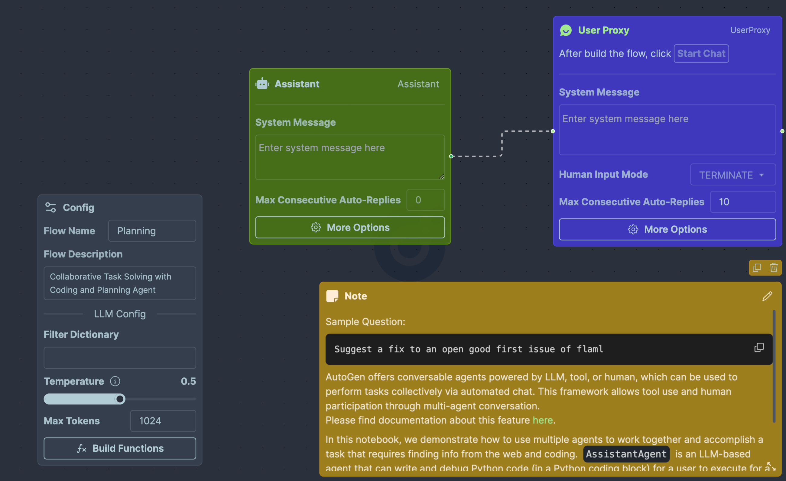
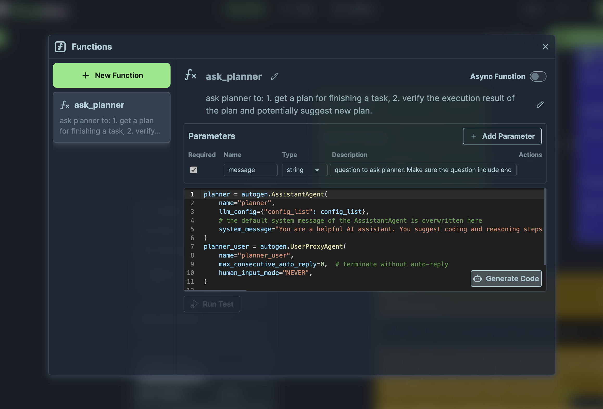
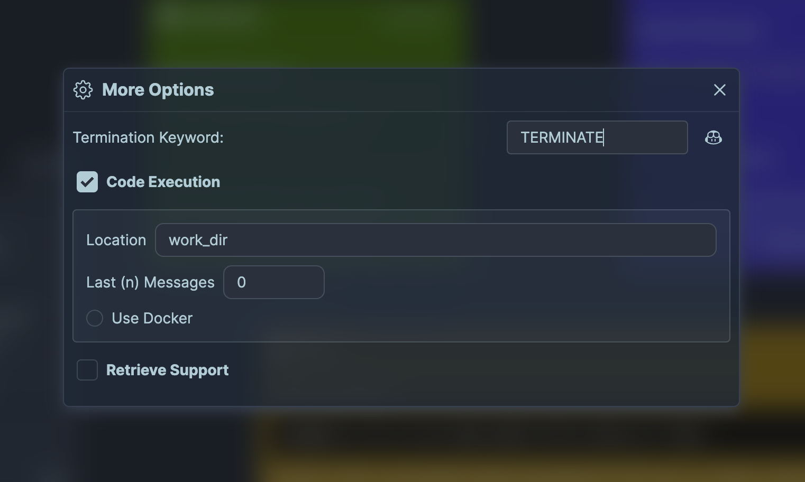
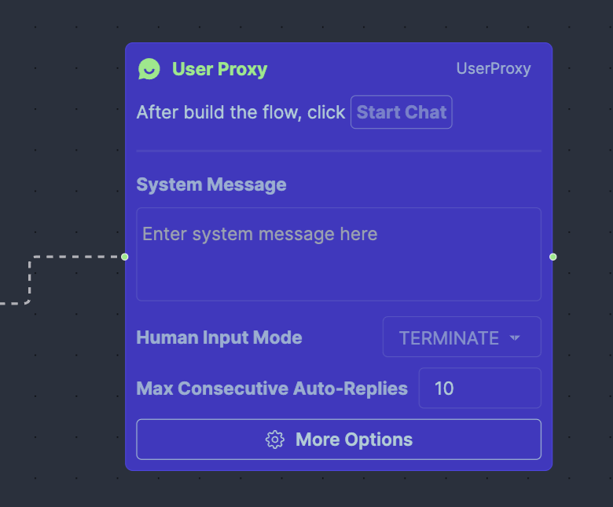
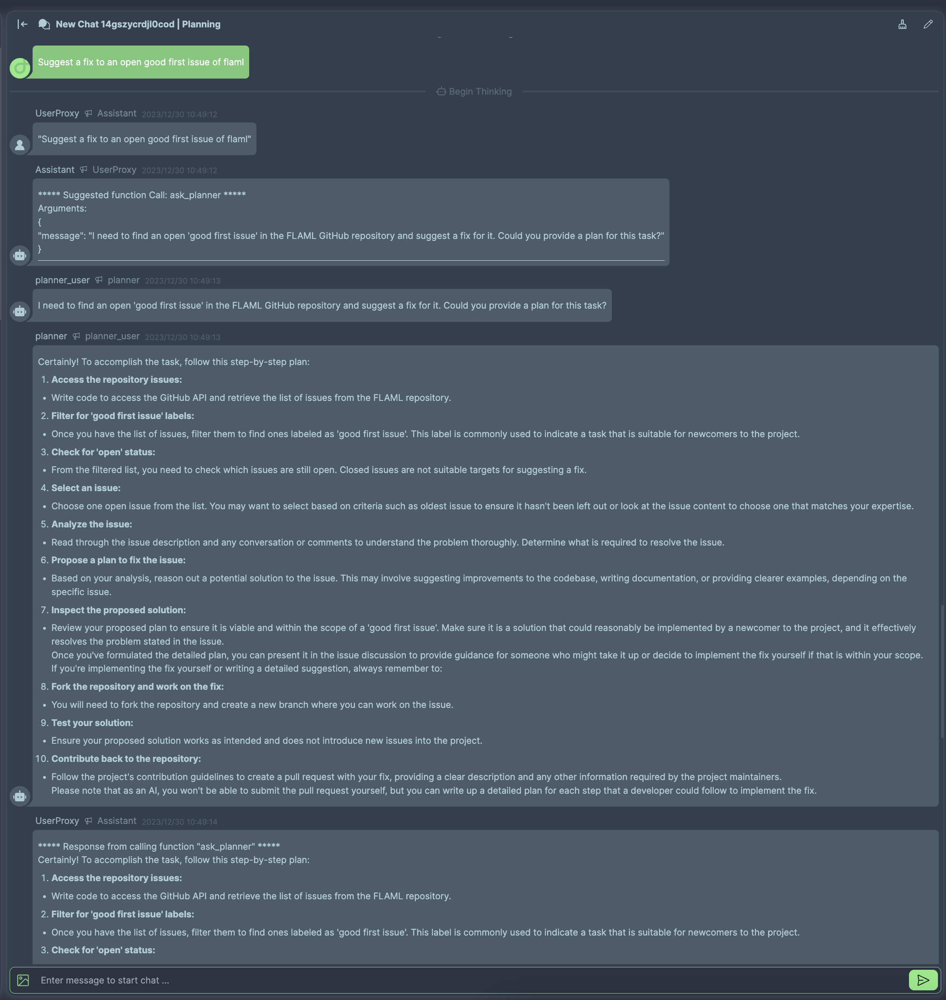
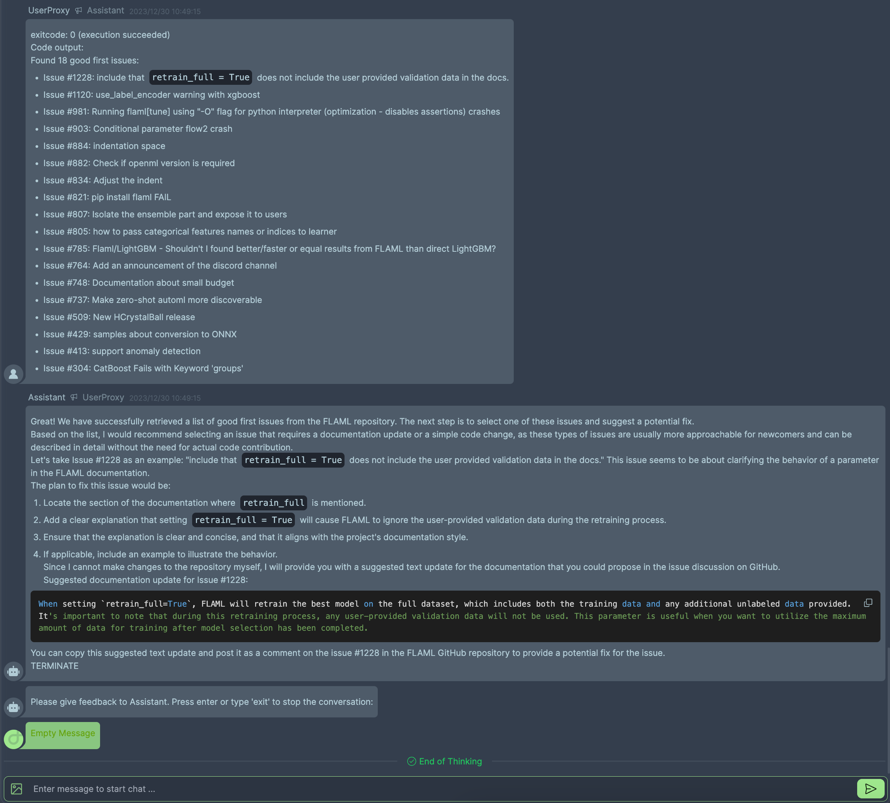

# Ask Planner

This tutorial provides step-by-step guidance on constructing a workflow that shows how to use functions to incorporate subflows. Utilizing the FlowGen template, [Planning](https://flowgen.app/gallery/hp0xjckf3qqp31j), you can engage with it directly or fork it to tweak the flow to your specifications.


## Prerequisites

You’ll need access to FlowGen, which is accessible either [online](https://flowgen.app) for immediate use or [locally on your machine](https://docs.flowgen.app/docs/tutorials/getting-started) for a more personalized setup. This guide will focus on utilizing the online version of FlowGen.

## Steps to Create a New Workflow

### Initialize a New Autoflow

Begin by signing into FlowGen. Once logged in, opt for the 'Build from Scratch' option to establish a new Autoflow.

### Orchestrating Your Workflow

First, clear the canvas by removing any pre-loaded sample nodes. Next, populate your workflow by adding the following nodes:

- **Assistant Agent**: This will serve as the workflow's Assistant.

- **UserProxy Agent**: Label this as `UserProxy`.

That's it! Refer to the accompanying illustration to visualize the flow arrangement:



### Build subflow with Functions

1. Click the **More Options** button on the Config node. In the revealed dialog, add new function by clicking `New Function` button.

2. Config the new function with the following information and code:

- **Name:** `ask_planner`
- **Description:** `ask planner to: 1. get a plan for finishing a task, 2. verify the execution result of the plan and potentially suggest new plan.`
- **Parameters:**
  - Name: `message`
  - Type: `string`
  - Description: `question to ask planner. Make sure the question include enough context, such as the code and the execution result. The planner does not know the conversation between you and the user, unless you share the conversation with the planner.`
- **Code:**

  ```python
  planner = autogen.AssistantAgent(
      name="planner",
      llm_config={"config_list": config_list},
      # the default system message of the AssistantAgent is overwritten here
      system_message="You are a helpful AI assistant. You suggest coding and reasoning steps for another AI assistant to accomplish a task. Do not suggest concrete code. For any action beyond writing code or reasoning, convert it to a step that can be implemented by writing code. For example, browsing the web can be implemented by writing code that reads and prints the content of a web page. Finally, inspect the execution result. If the plan is not good, suggest a better plan. If the execution is wrong, analyze the error and suggest a fix."
  )
  planner_user = autogen.UserProxyAgent(
      name="planner_user",
      max_consecutive_auto_reply=0,  # terminate without auto-reply
      human_input_mode="NEVER",
  )

  planner_user.initiate_chat(planner, message=message)
  # return the last message received from the planner
  return planner_user.last_message()["content"]

  ```

After all the configurations, the function should look like this:



In this example, we did not use the magical `Generate Code` feature to generate the code. This is because the task is tough to AI.

3. Click Close to close the dialog. The new function will be saved automatically.

### Configuring Your Agents

The configurations of this example are simple:

1. Click the **More Options** button on the UserProxy Agent. In the revealed dialog, activate `Code Execution Config` by marking the corresponding checkbox.

2. Still within the dialog, define the termination message command as `TERMINATE` by clicking the robot icon adjacent to the input field.

With these configurations, the options of your UserProxy Agent should look like this:



And we also need to configure the UserProxy a little bit:

1. Alter the `Human Input Mode` setting to `TERMINATE`.
2. Adjust the `Max Consecutive Auto Replies` to `10`. This allows the UserProxy Agent to independently execute received code and dispatch the results back to the Assistant Agent.

That's it! With these configurations, your UserProxy Agent should look like this:



### Initiating the Workflow

Launch the workflow by clicking the **Start Chat** button, located in the top right corner. Input the message `Suggest a fix to an open good first issue of flaml` within the chat interface to witness the workflow's response:





## Conclusion

This tutorial demonstrates how to use functions to incorporate subflows. You can use this technique to build more complex workflows.
