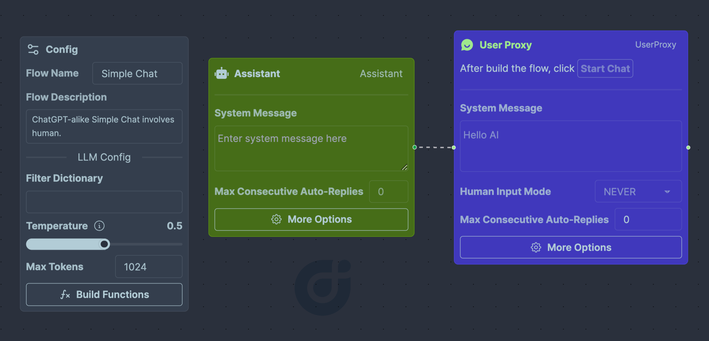
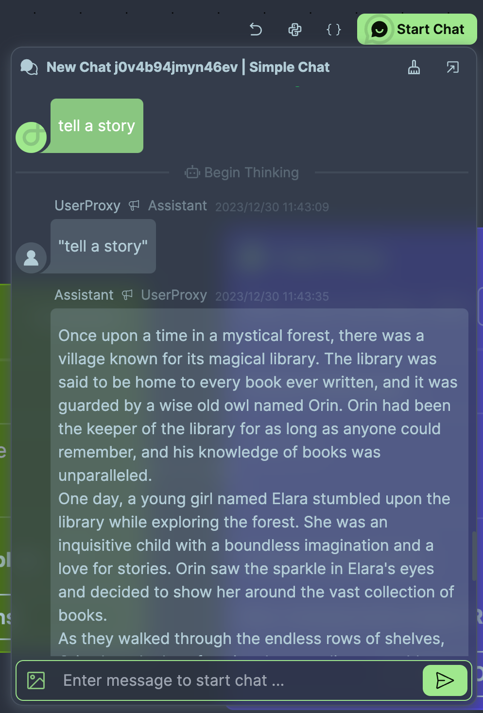

# Getting Started 🚀

## What is FlowGen

FlowGen is a tool built for [AutoGen](https://microsoft.github.io/autogen/), a fantastic agent framework from Microsoft Research.

AutoGen streamlines the process of creating multi-agent applications with its clear and user-friendly approach. FlowGen takes this accessibility a step further by offering visual tools that simplify the building and management of agent workflows.

## Basic Concepts

### 🕵️‍♂️ Agent

The `Agent` is the core concept in AutoGen and FlowGen. For applications, this usually means a `ConversableAgent`, which includes two types: `AssistantAgent` and `UserProxyAgent`.

- 👩‍💼 **Assistant Agent**

  The `AssistantAgent` is your go-to helper to accomplish a task—it could be a chatbot, a code generator, or a planner—perhaps even a blend of them.

- 🧑‍💻 **UserProxy Agent**

  The `UserProxyAgent` enables interaction with the `AssistantAgent`. It can take the form of a chatbot, a code executor, or even a human—it's quite the versatile agent.

### 🌊 Flow

A `Flow` consists of a network of `Agents`. It's the foundation of any multi-agent application.

A standard Flow usually includes one `UserProxyAgent` and one or several `AssistantAgents`. The `UserProxyAgent` is your direct line of interaction, while the `AssistantAgents` work behind the scenes, collaborating to build a robust multi-agent application.

### 📄 Template

Ready to launch a Flow? Publish it as a `Template` in the [FlowGen Gallery](https://flowgen.app/gallery/)! Users can then deploy these templates to conjure up new Flows or strike up chats directly on the template itself.

### 💬 Chat

Each Chat represents a live session that has been spun up from a Flow or a Template.

## "Hello World"

Let's jump straight in and create a simple "Hello World" flow.

### Initialize a New Flow

Head over to [FlowGen Login](https://flowgen.app/auth/login) and tap **Login as Guest** for a test run without the need to sign up.

> [!WARNING]
> Guest mode means your data is an open book to other guests. Sign in with your GitHub/Google/X account for a private experience.

Once you're in, go to the [homepage](https://flowgen.app) and hit the 'Build from Scratch' button to weave a new Flow.

### Build Your First Flow

Get started by tidying up the canvas—scrap any sample nodes that are hanging about. Now, let's get crafting:

1. Tap the plus sign ⨁ in the top left and ferry over an **Assistant Agent**.
2. Next, snag a **UserProxy Agent** and drop it in place.
3. Connect these two, and voilà—you've got flow! 🔗

Here’s a visual to guide you through:

### Start Chat

Fire up your flow by smashing the **Start Chat** button at the top right. Pop in the message `tell a story` and watch the magic unfold in your chat window:

## Next Steps

This tutorial was a breezy run-through, almost like a simplified ChatGPT.

Notice the conversation's quick? Just one round and boom, done—`UserProxyAgent` gets the message, and that's a wrap. But hey, let's spice things up with more features to give that flow a bit more oomph. Keep your eyes peeled! 👀

## More Readings

Got a taste for FlowGen? Feast on these resources for seconds:

- [FlowGen Gallery](https://flowgen.app/gallery/): Feast your eyes on a buffet of ready-to-serve templates.
- [FlowGen Documentation](https://flowgen.app/docs/): The ultimate guide to becoming a FlowGen whiz.
- [FlowGen GitHub](https://github.com/tiwater/flowgen): Peek under the hood at the source code.
- [AutoGen Documentation](https://microsoft.github.io/autogen/): Master the art of AutoGen with this comprehensive tutorial.
- [AutoGen Notebook](https://github.com/microsoft/autogen/tree/main/notebook): Dive into Jupyter notebooks showcasing AutoGen's prowess.

# Dive in and let the creativity flow! 💡
