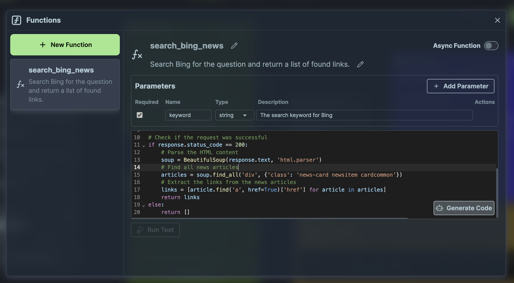
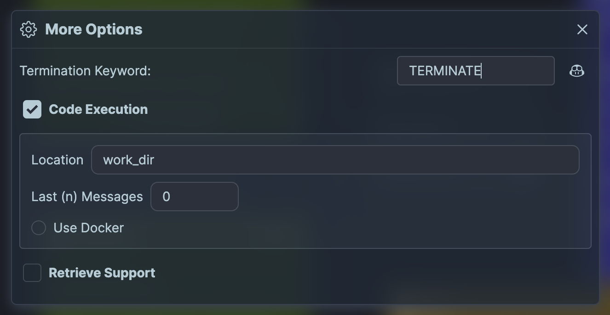
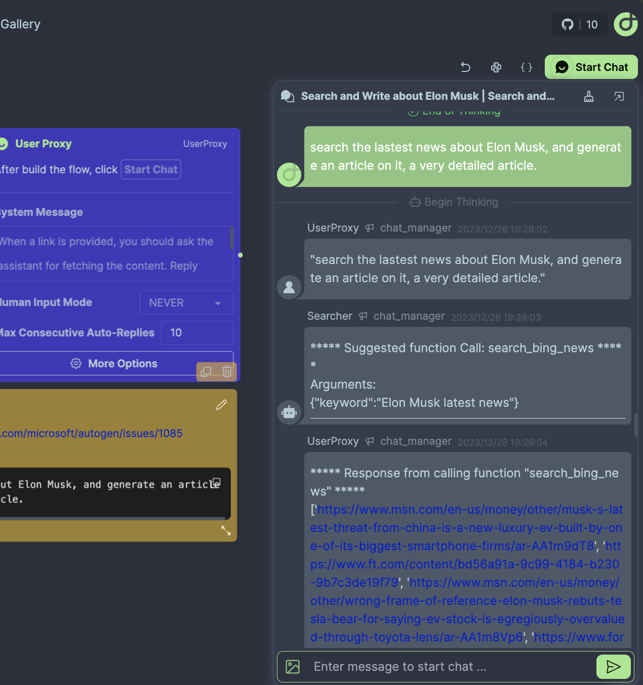

# Search and Write

In this tutorial, we'll dive into the use of FlowGen's GroupChat and Functions features to develop an agent capable of searching for online news and crafting articles for you.

You can access this tutorial as a FlowGen template named [Search and Write](https://platform.flowgen.app/gallery/udaciyj0xp325ye). Feel free to interact with it directly, or fork the flow to apply your custom modifications.

## Prerequisites

Before we begin, ensure you have access to FlowGen. You can explore FlowGen [online](https://platform.flowgen.app) or opt to [install it on your local system](https://github.com/tiwater/flowgen/).

This tutorial will utilize the online platform of FlowGen.

## Steps to Build Your Agent

### Initiating a New Autoflow

After logging into FlowGen, you can kickstart your new flow by clicking on 'Build from Scratch'.


### Orchestrating the Autoflow

Clear the deck by deleting any pre-existing sample nodes. Then, from the left panel, drag and drop the following nodes onto your workspace:

- First `Assistant Agent`, aptly named `Searcher`.
- Second `Assistant Agent`, titled `Writer` — make sure to append 'add TERMINATE at the end' in the `system_message`, otherwise the conversation will persist indefinitely.
- `UserProxy Agent`, referred to as `UserProxy`.
- `GroupChat`, with the `Involve User` option enabled.


### Integrating the Search Function

Now let's insert a search capability:

1. In the configuration node, select the `Build Functions` option to bring up the Function Editor.

2. Add a new function by clicking on the 'Add Function' button.

3. Name this function `search_bing_news`, and for its description, enter `Search Bing with the query and return a compilation of links.` Next, introduce a parameter termed `keyword`, and describe it as `The Bing search term.`

4. Generate the code by clicking on `Generate Code`. Please note that the function name, descriptions, and parameter explanations play a vital part in the accurate generation of code, so a clear and precise definition is critical.

5. Review the code for any potential errors or areas of improvement. AI is proficient but not infallible.

Once completed, your function editor should resemble this:



The auto-generated code will look something like this:

```python
import requests
from bs4 import BeautifulSoup

# Construct the search URL
search_url = f"""https://www.bing.com/news/search?q={keyword.replace(' ', '+')}&form=QBN&pq={keyword.replace(' ', '+')}&sc=8-0&sp=-1&qs=n&sk="""

# Perform the HTTP request to Bing
response = requests.get(search_url)

# Check if the request was successful
if response.status_code == 200:
    # Parse the HTML content
    soup = BeautifulSoup(response.text, 'html.parser')
    # Find all news articles
    articles = soup.find_all('div', {'class': 'news-card newsitem cardcommon'})
    # Extract the links from the news articles
    links = [article.find('a', href=True)['href'] for article in articles]
    return links
else:
    return []
```

### Verifying Configurations

Access the `More Options` on the UserProxy node ensuring that `Code Execution` is enabled.



Within the same dialog, you can set `TERMINATE` as the message's termination flag by clicking on the robot icon.

Rest assured, all configurations are preserved automatically.

### Initiating the Chat

Everything's set! Hit the `Start Chat` button situated on the canvas's top-right corner to engage with the Autoflow. Prompt the process with an entry like `search the latest news about Elon Musk and generate a detailed article on it.`

Consequently, the `Searcher` will retrieve a list of relevant links, after which the `Writer` expertly extracts information from these sources to fabricate a comprehensive article.



If the display area is inadequate, utilize the 'Open this chat in a new window' option for an expanded view.


Kudos! You've successfully configured an intelligent agent adept at performing online searches and article generation.

## Conclusion

Throughout this tutorial, we’ve explored the implementation of GroupChat and Functions within a flow, enabling code execution and agent collaboration. Additionally, you've learned to harness the Function Editor for creating custom functions to enhance your workflow.
